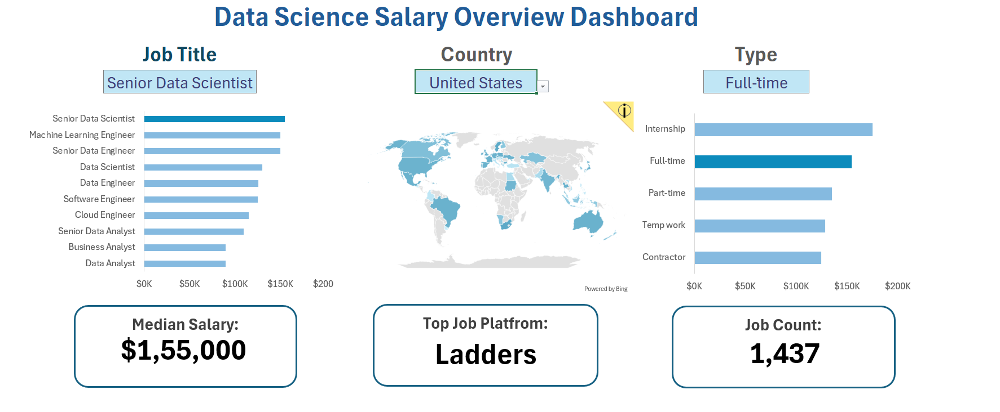

📊 Data Science Salary Overview Dashboard (Excel)

This project features an interactive Excel Dashboard created to analyze Data Science salary trends across different job roles, countries, and job types.
The dashboard uses data validation, data cleaning, and Excel map charts to provide clear and actionable insights.

🔥 Dashboard Preview

(

🚀 Features

✔️ Interactive dashboard built entirely in Microsoft Excel

✔️ Data Validation filters for Job Title, Country, and Job Type

✔️ Map Visualization for country-wise salary insights

✔️ Cleaned & structured dataset for accurate analysis

✔️ Bar charts & KPIs, including:

Median Salary

Total Job Count

Top Job Platform

✔️ Professional and user-friendly design

🛠️ Tools & Skills Used

Microsoft Excel

Data Cleaning

Data Validation

Excel Map Charts

Dashboard Design

KPI Visualization

📂 Project Structure
/Data
   └── cleaned_salary_data.xlsx
/Dashboard
   └── DataScience_Salary_Dashboard.xlsx
/Images
   └── dashboard_preview.png
README.md

🎯 Objective

To create a fully dynamic Excel dashboard that helps users explore salary patterns in Data Science across the world using clean, interactive, and visually appealing analytics.

📈 Key Insights from the Dashboard

Salary comparison across different job roles

Country-wise salary patterns using map charts

Full-time vs contractor pay distribution

Median salary and job availability metrics

Top platform for Data Science job listings

🔮 Future Enhancements

Add slicers for experience and education level

Integrate Power Query for automated data refresh

Build an advanced Power BI version

📬 Contact

If you'd like to explore more dashboards or collaborate, feel free to connect! 
NAME : BENSTEIN SM
EMAIL : bensteinsm@gmail.com
